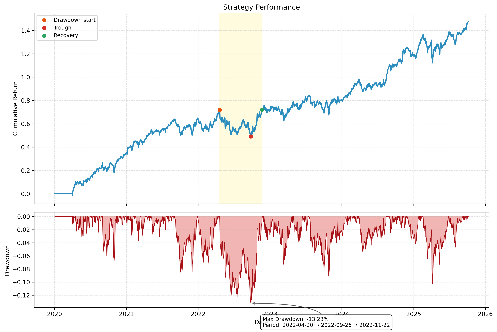

# Alpha-Factor Research and Strategy Optimization Framework (AFROS)

AFROS is a modular framework for researching, developing, and evaluating systematic trading strategies driven by alpha factors. It integrates signal generation, portfolio construction, and backtesting components in a clean, extensible architecture suitable for both academic-style research and real-world strategy prototyping. 

---

## 🌐 Project Overview

AFROS is built to address the end-to-end lifecycle of a systematic strategy:

1. **Signal Research**: Generate and evaluate predictive alpha signals (currently EWMA momentum).
2. **Portfolio Construction**: Allocate capital using advanced techniques such as Risk Parity.
3. **Strategy Evaluation**: Backtest with realistic assumptions, including holding periods, rebalancing frequency, and transaction constraints.

The framework currently focuses on **momentum-based factor investing** and is designed to scale to include additional alpha factors (e.g., value, volatility, seasonality) and portfolio optimization models (e.g., mean-variance, Black-Litterman).

---
## 📈 Strategy Performance

Below is the cumulative performance and drawdown of the strategy:

<p align="center">
  
</p>

## 🔧 Key Components

### 1. Signal Generation: `momentum.py`

## Trend Following

* **EWMA (Exponentially Weighted Moving Average)** weighted moving average.
* **SMA (Simple Moving average)**: Simple moving average crossover over long and short periods.

---

### 2. Portfolio Construction: `risk_parity.py`

* **risk parity** : Allocates risk evenly among selected assets.
* **kelly portfolio** : Allocates risk based of historic returns of assets.

---

### 3. Signal Filtering: `apply_signal_mask()`

* Applies binary signal mask to portfolio weights.
* Re-normalizes weights to ensure full allocation only to approved assets.

---

### 4. Backtesting Engine: `simulate.py`

* Evaluates portfolio performance over time with **explicit holding period constraints**.
* Simulates realistic trading: weights are updated every N days and held constant in between.

#### Features:

* Rolling rebalancing.
* Optional delayed execution (simulate trading one day after signal).
* Generates cumulative PnL time series.

---
---

## 🎯 Performance Metrics (optional modules)

* Sharpe Ratio
* Maximum Drawdown
* Turnover (for transaction cost modeling)
* CAGR and Volatility

---

## 🔬 Research Motivation

This project was created to explore how **momentum-based signals** can be effectively combined with **risk-based allocation** under realistic trading conditions. Most academic literature treats factor models and portfolio construction separately; AFROS unifies both under a clean and extendable architecture.

---

## 🚀 Future Work

* Add support for alternative alpha factors (value, mean-reversion, macro-based).
* Introduce transaction cost and slippage modeling.
* Parallelize and optimize the backtest for scalability.
* Deploy live with scheduled rebalancing via broker API.

---

## 📄 Requirements

* `pandas`, `numpy`, `cvxpy`
* `riskfolio-lib`
* `yfinance` for historical price data

Install all dependencies via:

```bash
pip install -r requirements.txt
```

---

## 📁 Project Structure

```
AFROS/
├── data/                 # Raw and processed price data
├── signals/              # Signal generation modules
├── portfolio/            # Portfolio construction logic
├── backtest/             # Simulation and evaluation tools
├── main.py               # End-to-end strategy pipeline
├── requirements.txt
└── README.md             # This file
```

---

## 🌟 Author

**Kashyap Melur Mahesh**
Quantitative strategy researcher & data scientist
[GitHub](https://github.com/kashyap333) | [LinkedIn](https://linkedin.com/in/kashyapmahesh)

---

## ⚡ Disclaimer

This is a research project for educational purposes. It is **not** investment advice. Always validate strategies with professional risk management before deployment.

## Strategy Performance\n\n
\n

## Strategy Performance\n\n
\n

## Strategy Performance\n\n
\n